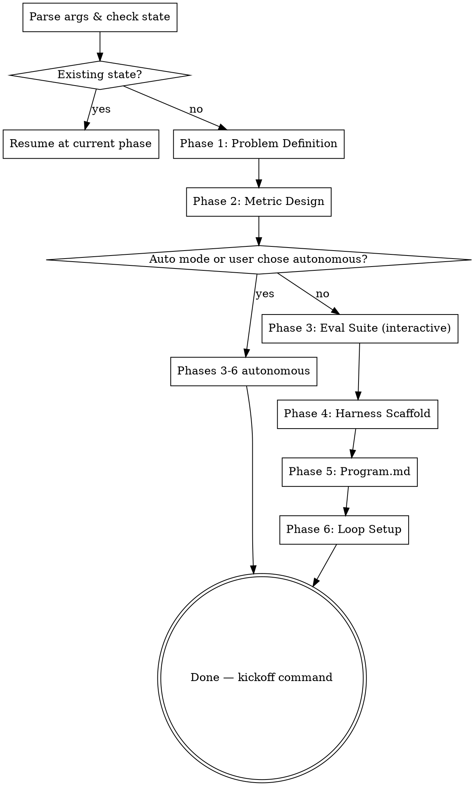

# autoeval Skill Implementation Plan

> **For agentic workers:** REQUIRED SUB-SKILL: Use superpowers:subagent-driven-development (recommended) or superpowers:executing-plans to implement this plan task-by-task. Steps use checkbox (`- [ ]`) syntax for tracking.

**Goal:** Build the autoeval Claude Code skill plugin — an orchestrator plus six phase skills that transforms vague optimization problems into fully scaffolded autonomous loops.

**Architecture:** Plugin follows the same structure as abdielou's e2e-skill and discovery-skill plugins. Each phase skill lives in its own subdirectory under `skills/`. Shared resources (loop type taxonomy) live in `skills/_shared/`. The orchestrator manages state in `.planning/autoeval/` and routes to phase skills. All skills are registered via `commands` array in `plugin.json`.

**Tech Stack:** Claude Code skill files (Markdown with YAML frontmatter), JSON plugin manifest

---

## File Structure

```
.claude-plugin/
  plugin.json                           # Plugin manifest
skills/
  autoeval/
    autoeval.md                         # Orchestrator — entry point, state management, routing
  problem-definition/
    problem-definition.md               # Phase 1 — interactive discovery, loop type classification
  metric-design/
    metric-design.md                    # Phase 2 — scoring function design, stress-testing
  eval-suite/
    eval-suite.md                       # Phase 3 — eval case building, scoring implementation
  harness-scaffold/
    harness-scaffold.md                 # Phase 4 — seed implementation generation
  program-md/
    program-md.md                       # Phase 5 — meta-agent directive generation
  loop-setup/
    loop-setup.md                       # Phase 6 — environment setup, verification, kickoff
  _shared/
    loop-types.md                       # 12 loop type taxonomy reference
    state-format.md                     # State file format specification
```

---

### Task 1: Plugin Infrastructure

**Files:**
- Create: `.claude-plugin/plugin.json`
- Create: `.gitignore`

- [ ] **Step 1: Create plugin manifest**

Create `.claude-plugin/plugin.json`:

```json
{
  "name": "autoeval",
  "description": "Transform vague optimization problems into fully scaffolded autonomous experiment loops with eval suites, scoring functions, and meta-agent directives.",
  "version": "0.1.0",
  "author": {
    "name": "abdielou"
  },
  "repository": "https://github.com/abdielou/autoeval",
  "commands": [
    "./skills/autoeval/autoeval.md",
    "./skills/problem-definition/problem-definition.md",
    "./skills/metric-design/metric-design.md",
    "./skills/eval-suite/eval-suite.md",
    "./skills/harness-scaffold/harness-scaffold.md",
    "./skills/program-md/program-md.md",
    "./skills/loop-setup/loop-setup.md"
  ]
}
```

- [ ] **Step 2: Create .gitignore**

Create `.gitignore`:

```
.planning/
node_modules/
.DS_Store
Thumbs.db
```

- [ ] **Step 3: Commit**

```bash
git add .claude-plugin/plugin.json .gitignore
git commit -m "feat: add plugin manifest and gitignore"
```

---

### Task 2: Shared Reference Files

**Files:**
- Create: `skills/_shared/loop-types.md`
- Create: `skills/_shared/state-format.md`

- [ ] **Step 1: Create loop types taxonomy reference**

Create `skills/_shared/loop-types.md`:

```markdown
# Autonomous Optimization Loop Types

A taxonomy of 12 meta-level patterns where a meta-agent autonomously iterates on a system to improve a measurable score.

Every loop shares the same abstract structure: **change → run → score → keep/discard → repeat**

Two axes distinguish loop types:
- **Edit surface** — what the meta-agent is allowed to modify
- **Scoring function** — how the result is automatically evaluated

---

## 1. Training Loop

**Edit surface:** Model architecture, training code, hyperparameters, data loading, optimization strategy.
**Scoring function:** Validation loss, accuracy, bits-per-byte, or other training metrics.

The meta-agent modifies a training script and measures whether the model got better. Autoresearch (Karpathy, 2025) is the canonical example.

## 2. Agent Harness Loop

**Edit surface:** System prompt, tool definitions, orchestration logic, sub-agent architecture, routing, verification steps.
**Scoring function:** Task pass rate, benchmark score, cost efficiency.

The meta-agent improves an AI agent's scaffolding. Autoagent (Kevin Gu, 2025) is the canonical example. Subsumes prompt-only optimization as a special case.

## 3. Generative Output Loop

**Edit surface:** Generation algorithms, synthesis parameters, transformation pipelines, rendering logic.
**Scoring function:** Similarity to reference outputs (spectral matching, perceptual metrics, structural similarity), LLM-as-judge, or composite quality scores.

Covers any loop where the system produces an artifact — audio, images, video, text, code — and is scored against quality targets. Includes DSP/signal synthesis, procedural content generation, and style transfer.

## 4. Algorithm Performance Loop

**Edit surface:** Implementation code, data structures, algorithmic approach, parallelization strategy, compiler flags, system configuration.
**Scoring function:** Speed, memory usage, accuracy, scalability, or weighted tradeoffs.

The meta-agent optimizes how something runs. Includes algorithmic optimization, hyperparameter search, and compiler/codegen optimization.

## 5. Retrieval and Ranking Loop

**Edit surface:** Chunking strategy, embedding model/configuration, indexing approach, retrieval logic, re-ranking rules, context assembly.
**Scoring function:** Recall, precision, MRR, NDCG, downstream task accuracy, answer quality.

The meta-agent optimizes how information is found and surfaced. RAG systems are the most common instance.

## 6. Pipeline Optimization Loop

**Edit surface:** Processing stages, transformation logic, filtering rules, data flow architecture, stage ordering.
**Scoring function:** Output quality, throughput, latency, error rate, cost.

The meta-agent improves a multi-stage data processing pipeline. Includes ETL, media processing, data cleaning, and feature engineering.

## 7. Simulation Calibration Loop

**Edit surface:** Simulation parameters, physics models, environment rules, agent behavior models.
**Scoring function:** Fit to real-world observed data (RMSE, correlation, distribution matching).

The meta-agent tunes a simulation to match reality. Includes physics, financial models, climate, traffic, and digital twins.

## 8. Strategy and Decision Loop

**Edit surface:** Decision rules, heuristics, evaluation functions, planning algorithms, game trees, resource allocation logic.
**Scoring function:** Win rate, expected value, regret, distance from known-optimal solutions.

The meta-agent improves a decision-making system. Includes game-playing, scheduling, trading strategies, and resource allocation.

## 9. Adversarial Loop

**Edit surface:** Attack vectors, defense mechanisms, detection rules, filtering logic, hardening measures.
**Scoring function:** Vulnerability discovery rate, resistance to attacks, false positive/negative rates.

The meta-agent improves either an attacker or defender. Includes security testing, robustness evaluation, jailbreak resistance, and content filtering.

## 10. Data Curation Loop

**Edit surface:** Dataset composition, filtering criteria, sampling strategy, augmentation methods, labeling rules, synthetic data generation.
**Scoring function:** Downstream model performance, data quality metrics, coverage, diversity.

The meta-agent optimizes the data itself. Score measured indirectly by training/evaluating a downstream system on the curated data.

## 11. Control Systems Loop

**Edit surface:** Controller parameters (PID gains, MPC horizons), control architecture, sensor fusion logic, actuator mapping.
**Scoring function:** Tracking error, stability margins, settling time, energy efficiency, safety constraint satisfaction.

The meta-agent tunes a control system — robotics, industrial automation, autonomous vehicles, HVAC, power grid.

## 12. Interface Optimization Loop

**Edit surface:** UI layout, interaction flows, content presentation, notification logic, onboarding sequences.
**Scoring function:** Task completion rate, engagement metrics, conversion, time-on-task, error rate.

The meta-agent optimizes how humans interact with a system. Extends traditional A/B testing into autonomous iteration.

---

## Properties

**Composability:** Loop types can nest. An outer agent harness loop might contain an inner prompt optimization sub-loop.

**Edit surface width:** Narrower surfaces converge faster but have lower ceilings. Wider surfaces explore more but need more experiments.

**Scoring function reliability:** Deterministic/cheap scores (unit tests, loss) vs. noisy/expensive (LLM-as-judge). Loop effectiveness depends heavily on scoring quality.

**Convergence characteristics:** Some loops hill-climb smoothly (parameter tuning). Others have discontinuous jumps (adding a new tool). The meta-agent's exploration strategy should match the landscape.
```

- [ ] **Step 2: Create state format reference**

Create `skills/_shared/state-format.md`:

```markdown
# autoeval State Format

All state persists in `.planning/autoeval/` in the user's working directory.

## state.md

```yaml
---
phase: 1          # Current phase (1-6) or "complete"
auto: false       # Whether --auto was passed
interactive: true # Whether user chose step-through after Phase 2
output_dir: "."   # Resolved output directory path
started: "2026-04-05"
---
```

## Phase Output Files

| Phase | File | Contents |
|-------|------|----------|
| 1 | `problem.md` | Problem summary, I/O, success criteria, constraints, loop type, output dir |
| 2 | `metric.md` | Scoring function spec, components, weights, floor/ceiling, risks |
| 3 | `eval-strategy.md` | Coverage dimensions, reference data sources, testability assessment |
| 4 | `baseline-score.md` | Seed harness score against eval suite |
| 5 | — | Output is `program.md` in the output directory |
| 6 | — | Output is environment files in the output directory |

## Resume Protocol

On re-invocation, the orchestrator:
1. Reads `state.md` to determine current phase
2. Checks if the current phase's output file exists (phase may be partially complete)
3. Routes to the appropriate phase skill
4. If no state exists, this is a new run — start Phase 1
```

- [ ] **Step 3: Commit**

```bash
git add skills/_shared/loop-types.md skills/_shared/state-format.md
git commit -m "feat: add shared reference files (loop taxonomy, state format)"
```

---

### Task 3: Orchestrator Skill

**Files:**
- Create: `skills/autoeval/autoeval.md`

- [ ] **Step 1: Create orchestrator skill**

Create `skills/autoeval/autoeval.md`:

```markdown
---
name: autoeval
description: "Transform a vague optimization problem into a fully scaffolded autonomous experiment loop. Use when user says 'autoeval', 'optimization loop', 'autonomous experiment', 'hill-climbing loop', or invokes /autoeval."
argument-hint: "<describe your optimization problem>"
---

# autoeval — Autonomous Optimization Loop Scaffolder

Transform a vague optimization problem into a fully scaffolded, runnable autonomous loop — bridging the gap between "I have an idea" and "I have an autonomous experiment running overnight."

## What This Produces

A complete, runnable optimization loop:
- `program.md` — meta-agent directive for Claude Code
- Seed harness file(s) — minimal baseline implementation with marked edit surface
- `evals/` — eval cases, scoring functions, runner, coverage docs
- Environment files — dependencies, Dockerfile (optional), .gitignore
- Kickoff command: `claude "$(cat program.md)"`

The loop follows: **change → run → score → keep/discard → repeat**

The meta-agent is always Claude Code via `claude` CLI. There is no custom loop runner — the loop logic lives in `program.md`, matching the patterns from autoagent and autoresearch.

## Invocation

```
/autoeval <problem description>
/autoeval --auto <problem description>
```

## Process



## Step 1: Parse Arguments and Check State

**Parse the invocation:**
- Extract `<problem description>` from args
- Detect `--auto` flag

**Check for existing state:**
- Read `.planning/autoeval/state.md` if it exists
- If state exists: announce "Resuming autoeval from Phase {N}" and route to that phase
- If no state: proceed to Step 2

**Determine output directory:**
- Run `ls` to check if the working directory has files (beyond `.git` and `.planning`)
- If empty: default output directory is `.` (root)
- If not empty: ask the user where to scaffold the experiment

**Initialize state:**
- Create `.planning/autoeval/` directory
- Write initial `state.md` with phase=1, auto flag, and output directory

## Step 2: Run Phase Skills in Sequence

Invoke each phase skill using the Skill tool. After each phase completes, update `state.md` to the next phase number.

**Phases 1-2 are always interactive:**
- Invoke `autoeval:problem-definition` — if it exits (problem isn't an optimization problem), stop here
- Invoke `autoeval:metric-design`

**After Phase 2, determine execution mode:**
- If `--auto` was passed: set `interactive: false` in state, proceed autonomously
- Otherwise: ask the user: "Metric locked in. Want me to build the rest autonomously, or step through each phase?"

**Phases 3-6:**
- Invoke `autoeval:eval-suite`
- Invoke `autoeval:harness-scaffold`
- Invoke `autoeval:program-md`
- Invoke `autoeval:loop-setup`

## Step 3: Completion

After Phase 6 completes, update state to `phase: complete` and present the kickoff summary from Phase 6's output.

## State Management

Read the state format specification from `skills/_shared/state-format.md` for details on state files and resume protocol.

After each phase skill completes:
1. Verify the phase's output file exists in `.planning/autoeval/`
2. Update `state.md` to the next phase number
3. Invoke the next phase skill

## Important

- **Exit ramp:** Phase 1 may determine the problem is not suited for an optimization loop. If so, it will explain why, suggest alternatives, and stop. Respect the exit — do not proceed to Phase 2.
- **Eval quality gate:** Even in autonomous mode, Phase 3 should pause and ask the user if the eval suite has weak coverage or the scoring function can't be verified.
- **Socrates integration:** Phases 1, 2, and 5 invoke the Socrates skill for dialectic stress-testing. If Socrates is not available, proceed without it — it's valuable but not required.
```

- [ ] **Step 2: Commit**

```bash
git add skills/autoeval/autoeval.md
git commit -m "feat: add autoeval orchestrator skill"
```

---

### Task 4: Phase 1 — Problem Definition Skill

**Files:**
- Create: `skills/problem-definition/problem-definition.md`

- [ ] **Step 1: Create problem definition skill**

Create `skills/problem-definition/problem-definition.md`:

```markdown
---
name: problem-definition
description: "Phase 1 of autoeval — interactive discovery to clarify the optimization problem, classify the loop type, and identify exit ramps. Use when autoeval orchestrator routes to Phase 1, or when user invokes directly."
---

# Phase 1: Problem Definition

Interactive discovery session that clarifies the user's optimization problem, classifies it against the loop type taxonomy, and determines whether it's actually suited for an autonomous optimization loop.

<HARD-GATE>
This phase MUST be interactive. Do not skip questions or assume answers. Each question is one message — wait for the user's response before continuing.
</HARD-GATE>

## Prerequisites

- Read `.planning/autoeval/state.md` to confirm we're in Phase 1
- If no state exists, this was invoked directly — create initial state first
- Load the user's problem description from the invocation args or ask for it

## Process

### Step 1: Understand the Problem

Ask the following questions **one at a time**. Adapt based on answers — skip questions that have already been answered. Use multiple choice when possible.

1. **What are you building?** — Get a concrete description, not an abstract goal
2. **What are the inputs and outputs?** — What goes in, what comes out, in what format
3. **What does "good" look like in plain language?** — How would a human judge the quality of the output
4. **What constraints exist?** — Hardware, latency, cost, dependencies, API limits, time budget per iteration

### Step 2: Classify the Loop Type

Read the loop type taxonomy from `skills/_shared/loop-types.md`.

Based on the user's answers, identify which loop type(s) fit:

1. Present your classification with reasoning: "This looks like a **[Loop Type]** because [reason]"
2. If the problem could map to multiple types, explain the distinction and let the user choose
3. If the problem suggests a composed loop (primary + nested), present both options:
   - **Simple:** Single loop with [primary type] — faster to set up, easier to debug
   - **Composed:** [Primary type] wrapping [secondary type] — higher ceiling, more complex

   Use the Socrates skill (if available) to help evaluate the tradeoffs. Let the user decide.

### Step 3: Exit Ramp Check

Evaluate whether this problem is actually suited for an autonomous optimization loop. Use the Socrates skill (if available) to stress-test this.

**Good candidates have:**
- A broad problem space where many approaches could work (not one obvious solution)
- An output that can be automatically scored (not requiring human judgment every iteration)
- An edit surface where small changes can produce measurable differences
- Enough iteration headroom — the problem benefits from 10+ experiments, not just 1-2

**Bad candidates (exit ramp):**
- Well-defined workflows with clear requirements ("just build it")
- Problems where the solution is obvious but needs implementation time
- Problems requiring human judgment on every output
- Problems with no automatable scoring function

**If exiting:**

> "This isn't a strong candidate for an autonomous optimization loop because [specific reason]. It's a [characterization] problem — [suggestion for what to do instead, e.g., 'you could ask Claude Code to build it directly']. Autoeval only scaffolds optimization loops, so I'll stop here."

**Do not offer to build the solution directly. Stop.**

Update `state.md` to `phase: exit` and return control to the orchestrator.

### Step 4: Write Problem Definition

Write `.planning/autoeval/problem.md`:

```markdown
# Problem Definition

## Summary
[2-3 sentence problem description]

## Inputs
[What goes into the system — format, sources, constraints]

## Outputs
[What comes out — format, quality expectations]

## Success Criteria
[What "good" looks like in plain language]

## Constraints
[Hardware, latency, cost, dependencies, time budget]

## Loop Type
**Primary:** [Loop type name]
**Reasoning:** [Why this classification]
**Composed:** [Secondary loop type, if any, or "None"]

## Output Directory
[Resolved path from orchestrator]
```

### Step 5: Advance State

Update `.planning/autoeval/state.md` to `phase: 2`.

Tell the user: "Problem defined. Moving to metric design — this is where we figure out how to automatically score your system's output."

Return control to the orchestrator to invoke Phase 2.
```

- [ ] **Step 2: Commit**

```bash
git add skills/problem-definition/problem-definition.md
git commit -m "feat: add Phase 1 problem definition skill"
```

---

### Task 5: Phase 2 — Metric Design Skill

**Files:**
- Create: `skills/metric-design/metric-design.md`

- [ ] **Step 1: Create metric design skill**

Create `skills/metric-design/metric-design.md`:

```markdown
---
name: metric-design
description: "Phase 2 of autoeval — interactive metric exploration and scoring function design. Use when autoeval orchestrator routes to Phase 2, or when user invokes directly."
---

# Phase 2: Metric Design

The hardest and most valuable phase. Help the user find an automatic scoring function that the meta-agent can use to evaluate each iteration of the optimization loop.

<HARD-GATE>
This phase MUST be interactive. The scoring function is the foundation of the entire loop — a bad metric produces a bad loop. Do not rush or skip the stress-testing step.
</HARD-GATE>

## Prerequisites

- Read `.planning/autoeval/problem.md` — load the full problem context
- Confirm we're in Phase 2 via `state.md`

## Process

### Step 1: Explore Scoring Approaches

Walk through these questions **one at a time**, adapting based on the problem type from Phase 1:

1. **Can the output be compared against known-good references?**
   - Exact match (diff, string comparison)
   - Similarity metrics (spectral matching, cosine similarity, BLEU/ROUGE)
   - Structural comparison (AST diff, schema validation)

2. **Is it binary pass/fail?**
   - Does the code compile / tests pass / output validate
   - Does the system meet a hard constraint (latency < Xms, memory < Y MB)

3. **Does it need LLM-as-judge?**
   - Qualitative evaluation where human judgment matters
   - Can we define rubrics that make LLM scoring reliable?
   - Cost implications: LLM-as-judge is expensive per iteration

4. **Is there a proxy metric that correlates with quality?**
   - Latency, token count, error rate, code coverage
   - Something cheap to measure that predicts the expensive-to-measure quality

5. **Can multiple metrics compose into a single score?**
   - Weighted sum (0.5 × accuracy + 0.3 × speed + 0.2 × size)
   - Threshold + optimize (must pass X, then optimize Y)
   - Pareto (track multiple metrics, keep improvements on any without regression)

### Step 2: Define Floor and Ceiling

For the proposed metric:
- **Floor:** What score does a random/trivial/worst-case baseline get? (This is the starting point)
- **Ceiling:** What score represents perfect performance? (This is the theoretical maximum)
- **Current state:** If there's an existing system, where does it score?

These establish the dynamic range. A metric where floor=0.95 and ceiling=1.0 is very different from floor=0.1 and ceiling=1.0.

### Step 3: Stress-Test the Metric

Use the Socrates skill (if available) to pressure-test the proposed metric. If Socrates is not available, work through these questions manually:

**Gameability:**
- Can the meta-agent find a shortcut that scores well but doesn't actually solve the problem?
- Example: An agent that always outputs the same "safe" answer might score well on average but be useless for hard cases
- What constraints prevent gaming?

**Signal strength:**
- Do small meaningful improvements produce measurably different scores?
- Or is the metric too noisy — random variation drowns out real improvements?
- How many eval cases are needed for a reliable signal?

**Cost per evaluation:**
- How long does one eval run take? (This × hundreds of iterations = total loop time)
- Can we use a cheap proxy for exploration and the expensive metric for validation?

**Failure modes:**
- What does the meta-agent optimize for if the metric has blind spots?
- Are there known weaknesses we should document for the user?

### Step 4: Lock In the Metric

Present the final metric design to the user for approval:

> "Here's the scoring function I'm proposing: [description]. It composes [N] components with weights [X]. The floor is [Y] and ceiling is [Z]. Known weaknesses: [list]. Does this look right?"

Wait for explicit approval before proceeding.

### Step 5: Write Metric Design

Write `.planning/autoeval/metric.md`:

```markdown
# Metric Design

## Scoring Function
[Plain language description of what the metric measures]

## Pseudocode
```
[Pseudocode implementation of the scoring function]
```

## Components
| Component | Weight | Description | Floor | Ceiling |
|-----------|--------|-------------|-------|---------|
| [name]    | [0.X]  | [what it measures] | [min] | [max] |

## Composite Score Formula
[How components combine into a single score]

## Floor and Ceiling
- **Floor (worst case):** [value] — [what produces this score]
- **Ceiling (perfect):** [value] — [what this represents]

## Known Weaknesses
- [Gameability risk and mitigation]
- [Blind spots in the metric]
- [Cost considerations]

## Data Requirements
- [Reference files, APIs, datasets needed for scoring]
- [Where to source them]
```

### Step 6: Handoff Decision

Update `state.md` to `phase: 3`.

If `auto: true` in state, tell the user: "Metric locked in. Proceeding autonomously through eval suite, harness, program.md, and loop setup."

Otherwise, ask: **"Metric locked in. Want me to build the rest autonomously, or step through each phase?"**

- If autonomous: set `interactive: false` in `state.md`
- If step-through: set `interactive: true` in `state.md`

Return control to the orchestrator.
```

- [ ] **Step 2: Commit**

```bash
git add skills/metric-design/metric-design.md
git commit -m "feat: add Phase 2 metric design skill"
```

---

### Task 6: Phase 3 — Eval Suite Skill

**Files:**
- Create: `skills/eval-suite/eval-suite.md`

- [ ] **Step 1: Create eval suite skill**

Create `skills/eval-suite/eval-suite.md`:

```markdown
---
name: eval-suite
description: "Phase 3 of autoeval — build eval cases, scoring functions, and coverage strategy. The most critical phase. Use when autoeval orchestrator routes to Phase 3, or when user invokes directly."
---

# Phase 3: Eval Suite

The crown jewel of autoeval. The eval suite is what makes the autonomous loop work — a bad eval produces a bad loop. This phase builds the test cases, scoring functions, and coverage strategy that the meta-agent will be measured against.

<HARD-GATE>
Even in autonomous mode, if the eval suite has weak coverage or the scoring function can't be verified, PAUSE and ask the user. Never produce a bad eval silently.
</HARD-GATE>

## Prerequisites

- Read `.planning/autoeval/problem.md` and `.planning/autoeval/metric.md`
- Confirm we're in Phase 3 via `state.md`
- Know the output directory from `state.md`

## Process

### Step 1: Coverage Strategy

Before writing any code, map the eval landscape. This is a planning step.

**Identify coverage dimensions:**
- What types of inputs exist? (categories, difficulty levels, edge cases)
- What failure modes should be tested? (adversarial, degenerate, boundary)
- What reference data is needed? (golden outputs, comparison baselines)
- What's testable now vs. needs future expansion?

**For each dimension, assess:**
- How many cases are needed for a reliable signal?
- Can cases be generated programmatically or do they need manual curation?
- Are there existing datasets or references to draw from?

If interactive: present the coverage strategy to the user and get feedback before proceeding.

Write `.planning/autoeval/eval-strategy.md`:

```markdown
# Eval Coverage Strategy

## Dimensions
| Dimension | Description | Cases Needed | Source |
|-----------|-------------|-------------|--------|
| [name]    | [what it tests] | [count] | [generated/curated/reference] |

## Reference Data
- [What reference data is needed]
- [Where to source it]
- [How to format it]

## Coverage Gaps
- [What can't be tested automatically]
- [What needs future expansion]
- [Suggested approach for filling gaps]

## Eval Size Target
- Seed eval: [N] cases (enough for reliable signal)
- Target eval: [M] cases (comprehensive coverage)
```

### Step 2: Scaffold Eval Directory

Create the eval directory structure in the output directory:

```
{output_dir}/evals/
  cases/              # Individual test cases
  scoring/            # Scoring function implementations
  runner.py           # Runs all cases, aggregates scores, outputs summary
  README.md           # How to run, expand, and understand the eval
```

The runner and scoring files should use the language most natural for the problem domain. Python is the default — adapt if the problem calls for something else.

**Runner requirements:**
- Accept a command or path to the system under test
- Run all cases in `cases/`
- Apply scoring functions from `scoring/`
- Output a JSON summary: `{"score": 0.XX, "components": {...}, "cases": [...]}`
- Print a human-readable summary to stdout
- Exit code 0 on success (regardless of score), non-zero on eval infrastructure failure

### Step 3: Build Cases

For each dimension from the coverage strategy:

If interactive:
1. Propose a batch of cases for the dimension
2. Explain what each case tests and why
3. Get user feedback — too easy? missing edge cases? wrong assumptions?
4. Write the approved cases to `evals/cases/`

If autonomous:
1. Generate cases for all dimensions
2. Include edge cases and adversarial scenarios
3. Write to `evals/cases/`

**Case format:** Each case is a file (or entry in a cases file) containing:
- Input data or input specification
- Expected behavior description (not necessarily exact output — could be constraints)
- Difficulty/category tags for analysis

The exact format depends on the problem domain. For simple cases, a JSON or YAML file per case works well. For complex cases (e.g., reference audio files), use a directory per case.

### Step 4: Implement Scoring Functions

Translate the metric design from Phase 2 into working code.

Create scoring function(s) in `evals/scoring/`:
- Each metric component gets its own function
- A composer function combines components into the composite score
- All functions are well-documented with expected input/output types

**Quality checks:**
- Scoring functions must be deterministic (same input → same score), except for LLM-as-judge components which should use temperature=0 or majority voting
- Scores must be in the expected range (0-1 or the defined floor-ceiling range)
- Edge cases handled: empty input, malformed output, timeout

### Step 5: Sanity Check

Run the eval suite against a trivial/null input:

```bash
# Run the eval with a trivial baseline
python evals/runner.py --target "echo 'hello'"  # or appropriate null baseline
```

**Verify:**
- [ ] Runs without errors
- [ ] Scores are not all zeros (eval is measuring something)
- [ ] Scores are not all ones (eval has discriminating power)
- [ ] Floor value matches expectation from Phase 2
- [ ] Individual case results make sense

If any check fails, fix the eval before proceeding. If interactive, show results to the user.

### Step 6: Document Coverage

Write `evals/README.md`:

```markdown
# Eval Suite

## Running the Eval

```bash
python evals/runner.py --target <command-to-run-system>
```

## Output Format

JSON summary to stdout with structure:
```json
{"score": 0.XX, "components": {"name": 0.XX}, "cases": [...]}
```

## Current Coverage

| Dimension | Cases | Status |
|-----------|-------|--------|
| [name]    | [N]   | [complete/partial] |

## Coverage Gaps

- [What's missing and why]
- [How to add more cases]
- [Suggested reference data sources]

## Expanding the Eval

To add a new case:
1. [Steps to create a new case file]
2. [How to add scoring for it]
3. [How to verify it works]
```

### Step 7: Advance State

Update `state.md` to `phase: 4`.

If interactive, tell the user: "Eval suite built with [N] cases across [M] dimensions. Moving to harness scaffolding — creating the seed implementation the meta-agent will iterate on."

Return control to the orchestrator.
```

- [ ] **Step 2: Commit**

```bash
git add skills/eval-suite/eval-suite.md
git commit -m "feat: add Phase 3 eval suite skill"
```

---

### Task 7: Phase 4 — Harness Scaffolding Skill

**Files:**
- Create: `skills/harness-scaffold/harness-scaffold.md`

- [ ] **Step 1: Create harness scaffolding skill**

Create `skills/harness-scaffold/harness-scaffold.md`:

```markdown
---
name: harness-scaffold
description: "Phase 4 of autoeval — generate the seed implementation with marked edit surface. Use when autoeval orchestrator routes to Phase 4, or when user invokes directly."
---

# Phase 4: Harness Scaffolding

Generate the seed implementation that the meta-agent will iterate on. This is intentionally minimal — a working baseline, not a good solution. The meta-agent's job is to make it better.

## Prerequisites

- Read `.planning/autoeval/problem.md`, `.planning/autoeval/metric.md`, `.planning/autoeval/eval-strategy.md`
- Confirm we're in Phase 4 via `state.md`
- The eval suite from Phase 3 must exist and pass its sanity check

## Process

### Step 1: Design the Edit Surface

Based on the problem and loop type, determine:

**What the meta-agent CAN modify (edit surface):**
- The core implementation files where the optimization happens
- Mark these clearly with comments:
  ```
  # === EDIT SURFACE START ===
  # The meta-agent may modify anything between these markers
  ...
  # === EDIT SURFACE END ===
  ```

**What the meta-agent must NOT modify (fixed infrastructure):**
- Data loading and I/O wiring
- The eval suite and scoring functions
- Environment configuration
- The edit surface markers themselves

If interactive, present the edit surface plan and confirm with the user.

### Step 2: Generate Seed Implementation

Create the seed harness file(s) in the output directory:

**Requirements:**
- Language and framework chosen based on the problem domain
- Intentionally minimal — the simplest possible approach that produces valid output
- Must run without errors
- Must produce output that the eval suite can score
- Edit surface clearly marked
- Fixed infrastructure clearly separated (in a different file or outside the markers)

**Common patterns by loop type:**
- **Training Loop:** `train.py` with basic model + training loop
- **Agent Harness Loop:** `agent.py` with system prompt + basic tool
- **Generative Output Loop:** `generate.py` with simplest synthesis approach
- **Algorithm Performance Loop:** `solution.py` with brute-force implementation
- **Retrieval/Ranking Loop:** `retrieval.py` with basic keyword search
- **Other:** Adapt to the domain

### Step 3: Generate Fixed Infrastructure

Create any supporting files the seed needs:
- Data loading utilities (if needed)
- Output formatting (to match eval expectations)
- Configuration files
- Helper scripts for running the harness

These files should be clearly documented as "do not modify" in comments.

### Step 4: Verify Baseline

Run the seed harness end-to-end:

1. Execute the seed implementation
2. Score its output with the eval suite
3. Record the baseline score

```bash
# Run seed
python {seed_file} {args}

# Score output
python evals/runner.py --target "{run_command}"
```

**The baseline score should be:**
- Above zero (the system produces something scoreable)
- Below the ceiling (there's room to improve)
- Near the floor value defined in Phase 2

Write `.planning/autoeval/baseline-score.md`:

```markdown
# Baseline Score

**Score:** [X.XX]
**Date:** [YYYY-MM-DD]
**Seed files:** [list of files]

## Component Breakdown
| Component | Score | Floor | Ceiling |
|-----------|-------|-------|---------|
| [name]    | [X.XX] | [min] | [max] |

## Notes
[Any observations about the baseline — what's working, what's clearly broken, where the easy wins are]
```

### Step 5: Advance State

Update `state.md` to `phase: 5`.

If interactive, tell the user: "Seed harness built. Baseline score: [X.XX] (floor: [Y], ceiling: [Z]). Moving to program.md generation — writing the directive the meta-agent will follow."

Return control to the orchestrator.
```

- [ ] **Step 2: Commit**

```bash
git add skills/harness-scaffold/harness-scaffold.md
git commit -m "feat: add Phase 4 harness scaffolding skill"
```

---

### Task 8: Phase 5 — Program.md Generation Skill

**Files:**
- Create: `skills/program-md/program-md.md`

- [ ] **Step 1: Create program.md generation skill**

Create `skills/program-md/program-md.md`:

```markdown
---
name: program-md
description: "Phase 5 of autoeval — generate the meta-agent directive (program.md). Use when autoeval orchestrator routes to Phase 5, or when user invokes directly."
---

# Phase 5: Program.md Generation

Write the meta-agent directive — the `program.md` file that tells Claude Code how to run the autonomous optimization loop. This is the instruction manual for the overnight experiment.

## Prerequisites

- Read all prior state: `problem.md`, `metric.md`, `eval-strategy.md`, `baseline-score.md`
- Confirm we're in Phase 5 via `state.md`
- The seed harness and eval suite must exist and be verified

## Process

### Step 1: Generate program.md

Write `program.md` in the output directory with the following sections:

```markdown
# [Problem Name] — Autonomous Optimization Loop

## Goal

[2-3 sentences describing what this loop is trying to achieve, in plain language. Include the current baseline score and what a good target would be.]

## Edit Surface

You may modify these files:
- `[file1.py]` — [what it contains, what to experiment with]
- `[file2.py]` — [what it contains, what to experiment with]

You MUST NOT modify:
- `evals/` — the eval suite is fixed. Do not modify scoring or cases.
- `[fixed_file.py]` — [why it's fixed]
- `program.md` — do not modify this directive

## Iteration Protocol

Follow this loop indefinitely:

1. **Analyze** — Review the current implementation and previous experiment results. Identify a specific hypothesis to test.

2. **Change** — Make a focused modification to the edit surface. Change one thing at a time so you can attribute score changes to specific modifications.

3. **Run** — Execute the eval suite:
   ```bash
   [exact eval command]
   ```

4. **Score** — Read the eval output. The composite score is [description of scoring]. Current best: [baseline from Phase 4].

5. **Decide:**
   - If score >= previous best: `git add -A && git commit -m "experiment: [what you changed] — score [X.XX]"`
   - If score < previous best: `git checkout -- .` to revert all changes

6. **Repeat** — Go back to step 1. Try a different approach.

## Scoring Interpretation

[Explain what the score means, what each component measures, and what tradeoffs to watch for]

- Score range: [floor] to [ceiling]
- Current baseline: [X.XX]
- Target: [reasonable target based on problem]

## Domain-Specific Guidance

[Tailored hints based on the loop type and problem domain. Examples:]

- [For audio: "Consider spectral analysis tools, harmonic layering, filter design"]
- [For agents: "Try different tool combinations, multi-agent architectures, verification steps"]
- [For ML: "Experiment with architectures, learning rates, data augmentation"]

## Constraints

- Do NOT modify the eval suite or scoring functions
- Do NOT modify fixed infrastructure files
- Do NOT skip the eval — every change must be scored
- Do NOT make multiple unrelated changes in one iteration
- Keep experiments focused — one hypothesis per iteration
- Commit messages must include the score for tracking

## NEVER STOP

Continue experimenting indefinitely. There is always room for improvement. If you feel stuck, try a radically different approach rather than stopping.

When you've exhausted incremental improvements in one direction:
- Step back and reconsider the overall architecture
- Try approaches you haven't tried yet
- Look at the worst-scoring cases and focus there
- Consider the domain guidance above for new ideas
```

### Step 2: Stress-Test with Socrates

Use the Socrates skill (if available) to review `program.md` for:

**Ambiguity:**
- Could any instruction be interpreted in a way that leads the meta-agent off-rails?
- Are the edit surface boundaries crystal clear?
- Is the eval command unambiguous?

**Missing constraints:**
- Could the meta-agent game the eval? (e.g., hardcoding outputs for known test cases)
- Are there modifications that would technically improve the score but defeat the purpose?
- Add explicit constraints for any discovered gaps

**Clarity:**
- Would a fresh Claude Code instance understand exactly what to do from this file alone?
- Are all file paths correct and commands runnable?

If Socrates is not available, review these questions manually. Fix any issues found.

### Step 3: Advance State

Update `state.md` to `phase: 6`.

If interactive, tell the user: "program.md generated. Moving to loop setup — wiring everything together and verifying the baseline."

Return control to the orchestrator.
```

- [ ] **Step 2: Commit**

```bash
git add skills/program-md/program-md.md
git commit -m "feat: add Phase 5 program.md generation skill"
```

---

### Task 9: Phase 6 — Loop Setup Skill

**Files:**
- Create: `skills/loop-setup/loop-setup.md`

- [ ] **Step 1: Create loop setup skill**

Create `skills/loop-setup/loop-setup.md`:

```markdown
---
name: loop-setup
description: "Phase 6 of autoeval — wire everything together, verify baseline, provide kickoff command. Use when autoeval orchestrator routes to Phase 6, or when user invokes directly."
---

# Phase 6: Loop Setup

The final phase. Wire everything together, verify the full loop works end-to-end, and give the user the command to kick off the autonomous experiment.

## Prerequisites

- Read all prior state
- Confirm we're in Phase 6 via `state.md`
- All artifacts must exist: eval suite, seed harness, program.md

## Process

### Step 1: Environment Setup

Generate environment files in the output directory:

**Dependency manifest** (choose based on problem domain):
- Python: `pyproject.toml` or `requirements.txt`
- Node: `package.json`
- Other: appropriate manifest

Include all dependencies needed by:
- The seed harness
- The eval suite
- The scoring functions

**Dockerfile** (optional — generate if the problem benefits from isolation):
- Base image appropriate for the domain
- Install dependencies
- Copy project files
- Set working directory

**.gitignore** (if not already present in output dir):
- Generated artifacts (model checkpoints, audio files, etc.)
- Temporary files
- Environment-specific files

### Step 2: Initialize Git

If the output directory is not already a git repo:

```bash
cd {output_dir}
git init
```

Stage and commit all generated files:

```bash
git add -A
git commit -m "autoeval: initial baseline — score {baseline_score}"
```

If the output directory IS already a git repo, commit the autoeval files:

```bash
git add program.md evals/ {seed_files} {env_files}
git commit -m "autoeval: initial baseline — score {baseline_score}"
```

### Step 3: End-to-End Verification

Run the complete loop once manually to verify everything works:

1. **Install dependencies:**
   ```bash
   # e.g., pip install -e . or npm install
   ```

2. **Run the seed harness:**
   ```bash
   {seed_run_command}
   ```

3. **Run the eval suite:**
   ```bash
   {eval_run_command}
   ```

4. **Verify the score matches the baseline from Phase 4**

If anything fails, fix it before presenting the kickoff command. The user should never receive a broken loop.

### Step 4: Present Kickoff

Update `state.md` to `phase: complete`.

Present the final summary to the user:

---

**autoeval setup complete.**

**Problem:** [one-line summary]
**Loop type:** [classification]
**Baseline score:** [X.XX] (floor: [Y], ceiling: [Z])
**Eval cases:** [N] cases across [M] dimensions

**To start the autonomous experiment:**

```bash
cd {output_dir}
claude "$(cat program.md)"
```

**Monitoring:**
- Check progress: `git log --oneline` — each successful iteration is a commit with the score
- Stop the loop: interrupt the Claude Code session (Ctrl+C)
- Steer the loop: edit `program.md` constraints or domain guidance, then restart

**Expanding the eval:**
- See `evals/README.md` for how to add cases
- See `.planning/autoeval/eval-strategy.md` for coverage gaps and expansion plan

---
```

- [ ] **Step 2: Commit**

```bash
git add skills/loop-setup/loop-setup.md
git commit -m "feat: add Phase 6 loop setup skill"
```

---

### Task 10: Integration Verification

**Files:** None (verification only)

- [ ] **Step 1: Verify directory structure**

```bash
find . -name "*.md" -not -path "./.git/*" -not -path "./.planning/*" | sort
```

Expected output:
```
./.gitignore
./docs/superpowers/plans/2026-04-05-autoeval-skill.md
./docs/superpowers/specs/2026-04-05-autoeval-skill-design.md
./skills/_shared/loop-types.md
./skills/_shared/state-format.md
./skills/autoeval/autoeval.md
./skills/eval-suite/eval-suite.md
./skills/harness-scaffold/harness-scaffold.md
./skills/loop-setup/loop-setup.md
./skills/metric-design/metric-design.md
./skills/problem-definition/problem-definition.md
./skills/program-md/program-md.md
```

- [ ] **Step 2: Verify plugin.json references**

Check that every path in `plugin.json` `commands` array points to an existing file:

```bash
cat .claude-plugin/plugin.json | python -c "
import json, sys, os
data = json.load(sys.stdin)
for cmd in data['commands']:
    exists = os.path.exists(cmd.lstrip('./'))
    status = 'OK' if exists else 'MISSING'
    print(f'{status}: {cmd}')
"
```

Expected: all OK.

- [ ] **Step 3: Verify frontmatter in all skill files**

Check that every skill file has valid YAML frontmatter with `name` and `description`:

```bash
for f in skills/*//*.md; do
    echo "=== $f ==="
    head -5 "$f"
    echo ""
done
```

Expected: each file starts with `---`, has `name:` and `description:` fields, ends with `---`.

- [ ] **Step 4: Verify cross-references**

Check that skill files reference existing shared files:

```bash
grep -r "_shared/" skills/ --include="*.md" | grep -v "^Binary"
```

Expected: references to `skills/_shared/loop-types.md` and `skills/_shared/state-format.md` should all point to existing files.

- [ ] **Step 5: Final commit**

If any fixes were needed during verification:

```bash
git add -A
git commit -m "fix: address integration verification issues"
```
