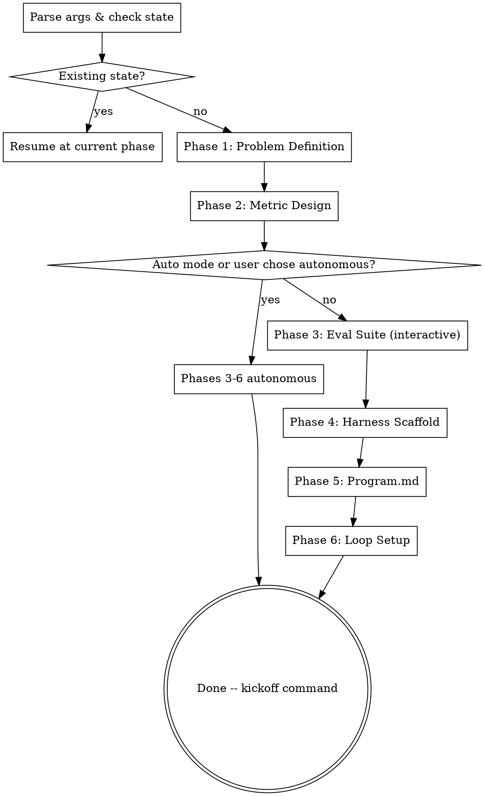

# autoeval -- Autonomous Optimization Loop Scaffolder

Transform a vague optimization problem into a fully scaffolded, runnable autonomous loop -- bridging the gap between "I have an idea" and "I have an autonomous experiment running overnight."

## What This Produces

A complete, runnable optimization loop:
- `program.md` -- meta-agent directive for Claude Code
- Seed harness file(s) -- minimal baseline implementation with marked edit surface
- `evals/` -- eval cases, scoring functions, runner, coverage docs
- Environment files -- dependencies, Dockerfile (optional), .gitignore
- Kickoff command: `claude "$(cat program.md)"`

The loop follows: **change -> run -> score -> keep/discard -> repeat**

The meta-agent is always Claude Code via `claude` CLI. There is no custom loop runner -- the loop logic lives in `program.md`, matching the patterns from autoagent and autoresearch.

## Invocation

```
/autoeval <problem description>
/autoeval --auto <problem description>
```

## Process



## Step 1: Parse Arguments and Check State

**Parse the invocation:**
- Extract `<problem description>` from args
- Detect `--auto` flag

**Check for existing state:**
- Read `.planning/autoeval/state.md` if it exists
- If state exists: announce "Resuming autoeval from Phase {N}" and route to that phase
- If no state: proceed to Step 2

**Determine output directory:**
- Run `ls` to check if the working directory has files (beyond `.git` and `.planning`)
- If empty: default output directory is `.` (root)
- If not empty: ask the user where to scaffold the experiment

**Initialize state:**
- Create `.planning/autoeval/` directory
- Write initial `state.md` with phase=1, auto flag, and output directory
- See `skills/_shared/state-format.md` for the state file format

## Step 2: Run Phase Skills in Sequence

Invoke each phase skill using the Skill tool. After each phase completes, update `state.md` to the next phase number.

**Phases 1-2 are always interactive:**
- Invoke `autoeval:problem-definition` -- if it exits via the exit ramp (problem isn't an optimization problem), stop here
- Invoke `autoeval:metric-design`

**After Phase 2, determine execution mode:**
- If `--auto` was passed: set `interactive: false` in state, proceed autonomously
- Otherwise: ask the user: "Metric locked in. Want me to build the rest autonomously, or step through each phase?"

**Phases 3-6:**
- Invoke `autoeval:eval-suite`
- Invoke `autoeval:harness-scaffold`
- Invoke `autoeval:program-md`
- Invoke `autoeval:loop-setup`

## Step 3: Completion

After Phase 6 completes, update state to `phase: complete` and present the kickoff summary from Phase 6's output.

## State Management

After each phase skill completes:
1. Verify the phase's output file exists in `.planning/autoeval/`
2. Update `state.md` to the next phase number
3. Invoke the next phase skill

## Important

- **Exit ramp:** Phase 1 may determine the problem is not suited for an optimization loop. If so, it will explain why, suggest alternatives, and stop. Respect the exit -- do not proceed to Phase 2.
- **Eval quality gate:** Even in autonomous mode, Phase 3 should pause and ask the user if the eval suite has weak coverage or the scoring function can't be verified.
- **Socrates integration:** Phases 1, 2, and 5 invoke the Socrates skill for dialectic stress-testing. If Socrates is not available, proceed without it -- it's valuable but not required.
